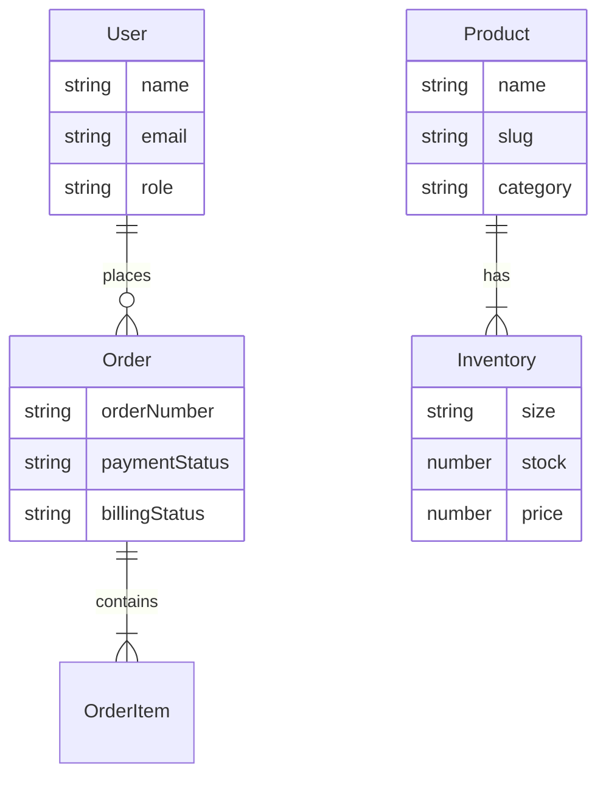

# System Implementation & Design Document

## 1. Executive Summary
Scarlet Fashion is a high-performance hybrid retail platform designed to bridge the gap between online e-commerce and offline retail operations. It features a premium Next.js frontend, a robust Node.js backend with concurrency management, and a dedicated offline-capable sync agent for seamless integration with legacy POS systems (E4U).

## 2. Component Architecture

### 2.1 Frontend (`scarlet-fashion`)
- **Technology**: Next.js 14, TypeScript, TailwindCSS, Zustand, React Query.
- **Key Features**:
  - **Server Components (RSC)**: Optimized SEO and initial load.
  - **Optimistic Updates**: Instant UI feedback for cart/wishlist.
  - **AuthGuard**: Role-based access control (RBAC).

### 2.2 Backend (`scarlet-fashion-backend`)
- **Technology**: Node.js, Express, MongoDB (Mongoose), Redis (ioredis), Zod.
- **Key Patterns**:
  - **Modular Monolith**: Code organized by business domains (`auth`, `products`, `orders`).
  - **Two-Token Auth**: JWT Access (15m) + Refresh Tokens (7d) in httpOnly cookies.
  - **Concurrency Control**: Redlock-inspired Mutex on Product ID for stock reservation.

### 2.3 Sync Agent (`scarlet-fashion-sync-agent`)
- **Technology**: Node.js, SQLite (better-sqlite3), Axios.
- **Resilience Strategy**:
  - **Local Queue**: All tasks persist to SQLite before processing.
  - **Exponential Backoff**: Retries network calls (1s, 2s, 4s...) on failure.
  - **Idempotency**: Cloud accepts duplicate confirmation IDs without side effects.

## 3. Critical Workflows

### 3.1 Order Placement (Online)
1. **Cart Lock**: User clicks "Checkout". Backend acquires Redis lock for items.
2. **Stock Check**: Verify DB stock. If sufficient, decrement.
3. **Creation**: Create `Order` (Status: PENDING). Release Lock.
4. **Payment**: (Mock) Payment confirmed. Order -> PAID.

### 3.2 Offline Billing Sync (Shop)
1. **Poll**: Agent asks Cloud `GET /billing/pending-orders`.
2. **Queue**: Agent saves Order to Local SQLite.
3. **Export**: Agent converts Order to CSV -> `e4u_exports/IMPORT_....csv`.
4. **Bill**: (Human/Sim) Invoice created in E4U -> `e4u_exports/BILLED_....txt`.
5. **Detect**: Agent watches file, finds Invoice Number.
6. **Sync**: Agent `POST /billing/confirm` -> Cloud updates Order to BILLED.

## 4. Database Schema Relationships

